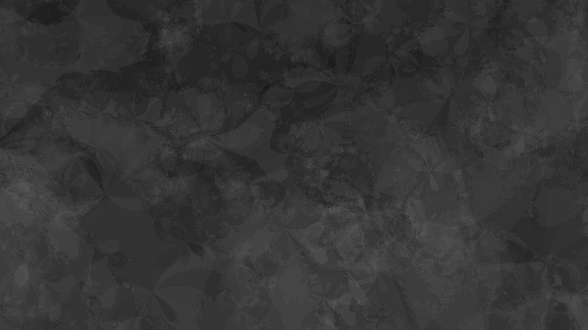

# Fractal_Image_Generator

Sometimes you may want your wallpapers/backgrounds to be different from others. Fractal images can satisfy this need. Although generating fractal images is generally simple, adjusting the parameters to make an image look harmonious may not be easy. Here this repository provides (is going to provide...) some examples of generating such images. If you like these styles, you may use these codes (directly, or as a starting point) to generate your own image.

## Newton Fractal (Dark wallpaper)
See newton_wallpaper.py

This code uses opencv-python and numpy. It may run about 20 min to generate a wallpaper (this time may vary if you change the parameters e.g. wallpaper shape in the code).

This code generates 10 images and calculate the average of them to generate a wallpaper. Each image is generated with Newton fractal from 10 randomly generated complex points. The color is set to dirtribute evenly in the range of [0, 0.3]. The default shape of the images is 1920x1080.

Below is an example:

## Newton Fractal (Dark wallpaper) *with PyTorch GPU acceleration*
newton_torch.py: Newton fractal image generator with PyTorch GPU accelaration.
Reduces the running time from around 20 min to around 1 min. Tested on Linux Mint 20.2, NVIDIA RTX 3080.

## Some Notes
* My colleague found that the PyTorch version of the code cannot run with the 'mps' devices. This issue is probably caused by the operations on complex numbers. Unfortunately, I cannot solve this problem now because I do not have such a device.
